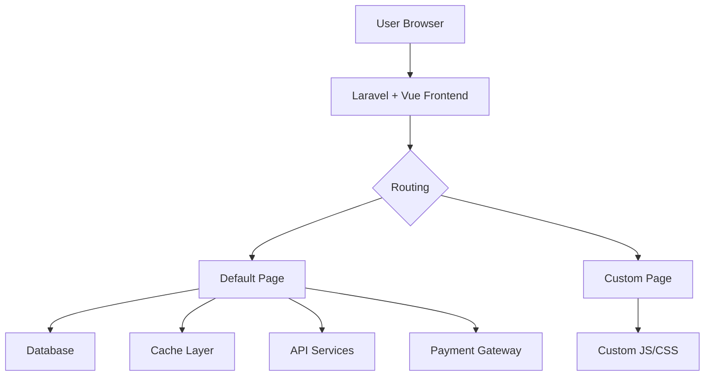
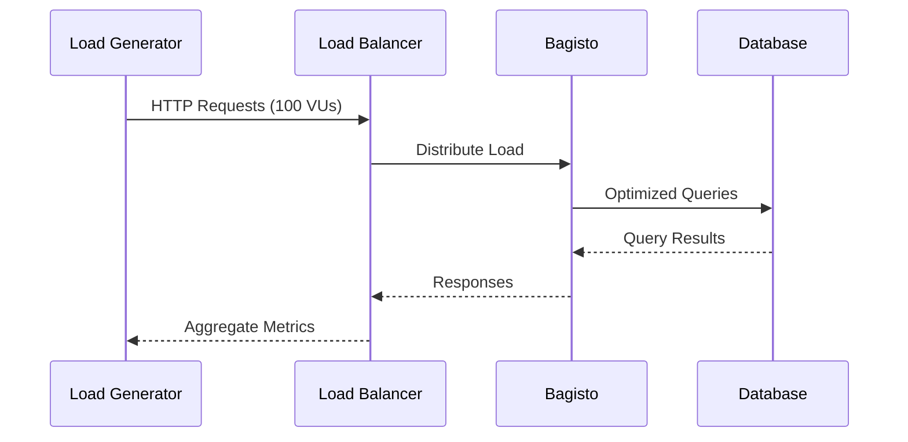

# Bagisto E-Commerce Platform


> A powerful, scalable, and customizable open-source e-commerce platform built on Laravel and Vue.js.
> 

## Project Overview

This repository hosts a **Bagisto-based e-commerce solution**, fully configured and ready for customization. Bagisto is an open-source framework designed to provide a modular and multi-vendor ready e-commerce system using Laravel, Symfony components, and Vue.js.

We've customized this instance to support:
- ✅ Custom page creation
- ✅ Integration of custom JavaScript & CSS files
- ✅ Theme overrides and frontend enhancements
- ✅ Multi-store configuration
- ✅ Vendor management (optional)
- ✅ REST API access for third-party integrations

---

## Features & Customization Capabilities

### Core Features

| Feature | Description |
|--------|-------------|
| Shopping Cart | Full cart functionality with guest checkout |
| Multi-Language | Support for multiple languages and locales |
| Inventory Management | Track product stock, manage variants |
| Customer Accounts | Login, wishlist, order history |
| Orders & Invoicing | Full order lifecycle support |
| Theme System | Fully customizable themes via Blade templates |

---

## Development Setup

### Prerequisites
- PHP 8.1+
- MySQL 5.7+
- Node.js 16.x
- Composer 2.x

### Installation
```bash
git clone https://github.com/engyahmed7/bagisto_ecommerce.git
cd bagisto_ecommerce
composer install --optimize-autoloader
php artisan install
```

```bash
# Optimize
php artisan optimize:clear
php artisan storage:link
```

---

## Customization Guide

### Adding Custom Pages
```php
// routes/web.php
Route::get('/custom-page', function () {
    return view('store::custom');
});
```

### CSS/JS Management
```blade
    @push('styles')
    <link href="{{ asset('vendor/shop/css/custom.css') }}" rel="stylesheet">
    @endpush

```

---

## Performance Metrics

### Load Testing with k6


### Test Execution
```bash
k6 run bagisto-loadtest.js
```

### 📊 Key Metrics from Test Run

```bash
 THRESHOLDS 

    http_req_duration
    ✗ 'p(95)<500' p(95)=21.39s   ❌ Threshold not met

    http_req_failed
    ✓ 'rate<0.01' rate=0.00%     ✅ Passed
```

| Metric | Value | Status |
|--------|-------|--------|
| 95th Percentile Response Time | 21.39s | ❌ Failed |
| Avg. Response Time | 17.04s | ❗ High |
| Failed Requests Rate | 0.00% | ✅ Passed |
| Throughput | ~4.74 req/s | 🟡 Moderate |
| Total Checks | 2900 | ✅ All passed |
| Data Received | 485 MB | - |

---

